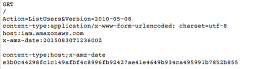
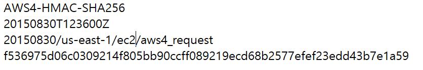
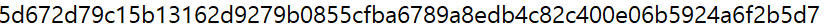
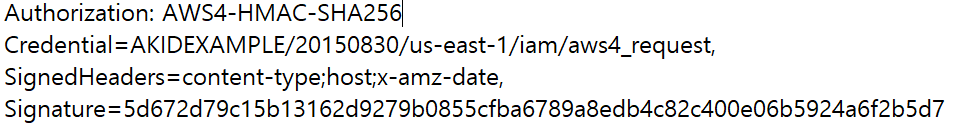

# URL을 사용하여 EC2제어

### AWS Using Query Parameters

--------------------

Amazon EC2 API는 이러한 파라미터를 지원한다

일반적인 매개변수는 요청에 서명하기 위해 서명버전 2, 서명버전 4를 사용하는지에 따라 달라진다

*여기에서는 서명버전 4를 사용하였다*


**필수  파라미터**
- Action: RunInstances,StopInstances등과 같이 행동 실행
- Version: 사용하는 API버전, 쿼리 요청 시 Action 파라미터를 포함해야 할 때, 사용하는 HTTPS요청
- X-Amz-Algorithm: AWS 시그니처 버전과 시그니처를 계산하는데 사용한 알고리즘을 식별함
- X-Amz-Credential: 엑세스키 ID외에도, 서명이 AWS영역 및 서비스 안에 유효한 범위인지 식별
- X-Amz-Date: 날짜 및 시간 형식은 ISO 8601표준을 따라야하며 "yyyy"로 포맷해야함
- X-Amz-SignedHeaders: 서명 계산에는 HTTP호스트 헤더와 요청에 추가할 X-Amz-header가 필요하고 보안을 강화해줌
- X-Amz-Signature: 요청을 인증하기위한 jaud제공, 이 서명은 AWS 내부에서 계산한 값과 일치해야함

<br/>

### AWS 서명 버전 4 요청 요소

-------------------

버전 4 서명을 사용하는 각 HTTP/HTTPS 요청은 이러한 요소를 반드시 포함해야함

- 엔드포인트 사양: HTTP/1.1 요청의 Host 헤더로 지정, 이 헤더는 요청전송하는 컴퓨터의 DNS이름 지정
    - 일반적으로 서비스 이름과 리전이 포함되며, 두 항목 모두 Credential 인증 파라미터의 일부로 사용해야함
- 작업: Amazon EC2 DescribeInstances 작업 처럼 웹서비스가 수행할 작업을 지정함
    - 지정한 작업은 요청에서 사용하는 파라미터 결정
- 필수 및 선택적 파라미터: 요청작업에 대한 파라미터 지정
- 날자: 요청을 한 날짜 및 시간
    - 요청에 날짜를 포함하면 타사가 요청을 가로채고 나중에 다시 전송하지 못하도록 차단할 수 있음
- 인증 파라미터: AWS가 요청의 유효성 및 진위를 확인하기 위해 사용
    - 알고리즘
    - 자격 증명 범위 :사용자의 액세스 키 ID와 자격 증명 범위 구성요소를 연결해 형성한 슬래시로 구분한 문자열
    - SignHeaders
    - Signature: 서명 작업의 출력을 나타내는 16진수로 인코딩한 문자열


### AWS 서명버4 단계 

-------------------


<br/>

0. 요청 내용,키,날짜문자열 생성
    1. 요청 내용
    ```
    method = ""
    service = ""
    host = ""
    region = ""
    endpoint = ""
    request_parameters = ""
    ```
    2. 키 명시
    ```
    access_key = ''
    secret_key = ''
    ```
    3. 날짜 문자열 생성
    ```
    t = datetime.datetime.utcnow()
    
    amzdate = t.strftime('%Y%m%dT%H%M%SZ')

    datestamp = t.strftime('%Y%m%d')
    ```

<br/>

1. 서명 버전 4에 대한 표준 요청 생성

- 서명 프로세스를 시작하려면 표준화된 형식의 요청 정보를 포함하는 문자열 생성

    1. 헤더이름과 signedheader, hash를 사용하여 requestbody 내용인 payload생성
    ```
    cannonical_uri = '/'
    cannonical_querystring = request_parameters


    cannonical_headers = 'host: '+ host + '\n'+ 'x-amz-date: '+ amzdate + '\n'

    signed_headers = 'host: x-amz-date'

    payload_hash = hashlib.sha256(('')).encode('utf-8')).hexdigest()
    ```
    - 서명할 문자열을 생성할 때 페이로드를 해시하는데 사용한 서명 알고리즘 지정
    - 페이로드가 비어있는 경우, 빈 문자열을 해시 함수에 대한 입력으로 사용
    
    <br/>

    2. 표준 request에 method, uri, query, headers, signedheaders, payload_hash를 넣음
    ```
    cannonical_request = method + '\n' + cannonical_uri + '\n' + cannonical_querystring + '\n' + cannonical_headers + '\n' + signedheaders + '\n' + payload_hash

*표준요청*



<br/>

2. 서명 버전4에 서명할 문자열 생성

- 서명할 문자열에는 사용자의 요청과 1에서 생성한 표준요청에 대한 메타정보가 포함
    1. 알고리즘 지정으로 시작
    2. 요청날짜값추가
    3. 자격증명 범위 값( 날짜,대상 리전, 서비스,소문자 종료 문자열('aws4_request'))를 포함
    4. 표준 요청의 해시 추가
    ```
    algorithm = 'AWS4-HMAC-SHA256'

    credential_scope = datestamp + '/' + region + '/' + service + '/' + 'aws4_request'

    string_to_sign = algorithm + '\n' + 
    amzdate + '\n' +credential_scope + '\n' + hashlib.sha256(cannonical_request.encode('utf-8')).hexdigest()
    ```

*서명할 문자열*


<br/>

3. AWS 서명 버전4에 대한 서명 계산

    **서명 키 추출 메소드**
    ```
    def sign(key, msg):
        return hmac.new(key, msg.encode("utf-8"), hashlib.sha256).digest()

    def getSignatureKey(key, dateStamp, regionName, serviceName):
        kDate = sign(("AWS4" + key).encode("utf-8"), dateStamp)
        kRegion = sign(kDate, regionName)
        kService = sign(kRegion, serviceName)
        kSigning = sign(kService, "aws4_request")
        return kSigning
    ```

    1. signing_key 생성
     ```
     signing_key = getSignatureKey(secret_key,datestamp,region,service)
     ```
     2. signature 생성
     ```
     signature = hmac.new(signing_key,(string_to_sign).encode('utf-8').hashlib.sha256).hexdigest()
     ```

*signature*


<br/>

4. http요청에 서명추가
- Authorization HTTP 헤더
- 쿼리문자열
```
authorization_header = algorithm + ' ' + 'Credential=' + access_key + '/' + credential_scope + ',' + 'SignedHeaders=' + signed_headers + ',' + 'Signature=' + signature

headers = {'x-amz-date': amzdate, 'Authorization': authorization_header
}
```

*Authorization header*



<br/>

5. requset 요청
```
request_url = endpoint + '?' + canonical_querystring

requests.get(request_url,headers = headers)
```

